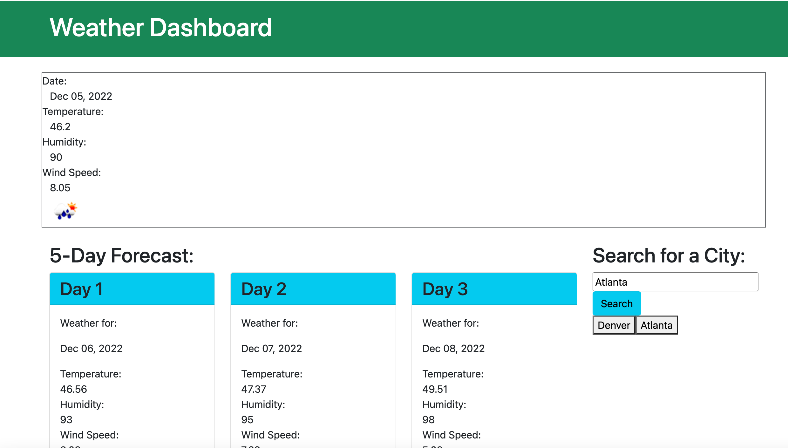

# Weather Dashboard, Module 6

Weather Dashboard Application 

## Description
This is a bootcamp design challenge that brings users to a landing page where they are able to input a city name and be presented with the current weather and forecast for the next five days. When users search a city, a new button is created that can be used to navigate back to the city weather following other searches. 

## Mockup

## Page Link
https://kristinbrewer.github.io/weather-dashboard/

## Installation
N/a

## Usage
To practice generating HTML code, JavaScript code, CSS code, web APIs and third party APIs. 

## Credits

N/A

## License 

Please refer to the Licesnse in the repo. 
